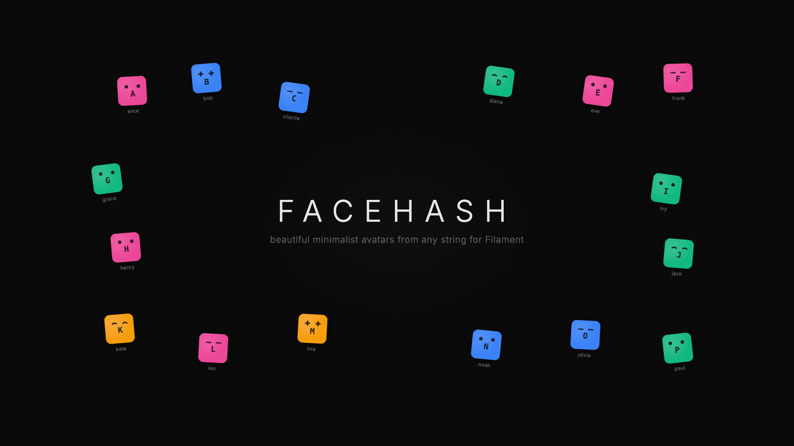

# Filament Facehash



Generate unique, deterministic avatar faces for your Filament panels. Drop-in replacement for default user avatars — same name always produces the same face. Pure SVG, no GD or Imagick required.

[Try the playground](https://facehash.saade.dev)

## Installation

```bash
composer require saade/filament-facehash
```

## Usage

Add the provider and plugin to your panel configuration:

```php
use Saade\FilamentFacehash\FacehashPlugin;
use Saade\FilamentFacehash\FacehashProvider;

public function panel(Panel $panel): Panel
{
    return $panel
        ->defaultAvatarProvider(FacehashProvider::class)
        ->plugins([
            FacehashPlugin::make(),
        ]);
}
```

## Configuration

Customize the avatars using the plugin's fluent API:

```php
use Saade\Facehash\Enums\Variant;
use Saade\FilamentFacehash\FacehashPlugin;

FacehashPlugin::make()
    ->size(40)                       // Avatar size in pixels (default: 40)
    ->variant(Variant::Gradient)     // Variant::Gradient or Variant::Solid (default: Gradient)
    ->initial(true)                  // Show first letter of name (default: true)
    ->colors([                       // Custom color palette
        '#ec4899',
        '#f59e0b',
        '#3b82f6',
        '#f97316',
        '#10b981',
    ])
```

For more configuration options (routes, default overrides, etc.), visit the [Facehash package documentation](https://github.com/saade/facehash).

## Model Trait

For using facehash avatars outside of Filament panels (e.g. in Blade views, notifications), add the trait to your User model:

```php
use Saade\FilamentFacehash\Concerns\HasFacehashAvatar;

class User extends Authenticatable
{
    use HasFacehashAvatar;
}
```

This gives you:

```php
$user->facehash_avatar_url  // data:image/svg+xml;base64,...
```

Override which attribute is used as the avatar name:

```php
use Illuminate\Database\Eloquent\Casts\Attribute;

public function facehashAvatarName(): Attribute
{
    return new Attribute(
        get: fn () => $this->email  // use email instead of name
    );
}
```

## Credits

- [Facehash for Laravel](https://github.com/saade/facehash) — the underlying PHP/Laravel package
- [Facehash](https://facehash.dev) by [Cossistant](https://github.com/cossistantcom/cossistant) — the original JavaScript library

## License

MIT
